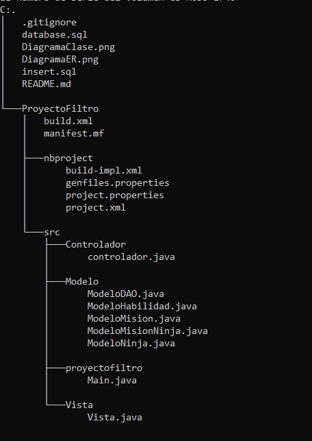

# FiltroJava_YurleyBotello


La aldea ninja de Konoha ha decidido modernizar su sistema de gestión de misiones y datos de los ninjas 
para mejorar la eficiencia y la coordinación entre los equipos. 
Se le ha encomendado la tarea de desarrollar una aplicación en Java que gestione esta información de manera integral.

En el analisis del caso de estudio se tuvieron en cuenta las siguientes entidades y atributos:

### Ninja: 
Se implemento la siguiente tabla para guardar cada uno de los datos de los ninjas ,como su respectivo Nombre
Aldea y Rango.

### Mision:
Se implemento la siguiente tabla para guardar cada uno de los datos de las misiones ,con sus respectivos atributos
Descripcion, Rango y Recompensa de dicha mision.

### Ninja/Mision:

Se impleto la siguiente tabla para permitir gestionar eficazmente cada una de la misones inicializada o finalizadas, cuenta con los siguientes atributos Id_ninja, Id_mision, Fecha inicio y Fecha fin.

### Habilidad:

Se implemento la siguiente base de datos para el manejo de la posibles habilidades que podria tener un ninja, cuenta con los siguientes atributos ID_Ninja, Nombre y Descripcion.

## ESTRUCTURA 


## REQUISITOS DEL SISTEMA

+ Tener MySQL Workbench
+ Tener NetBeans 17.0.12 
+ Tener mysql-connector-j-9.2.0

## TECNOLOGIAS UTILIZADAS
+ MYSQL
+ JAVA

## INSTALACION Y CONFIGURACION

+ El archivo database.sql: Contiene la creación de la base de datos con tablas y relaciones.

+ El archivo insert.sql: Contiene las inserciones de datos.


## INSTRUCCIONES DE USO

1. Debes tener instalada la aplicación de NetBeans 17.0.12 o otro navegador compatible para ejecutar el archivo.

2. clonar el repositorio y abrirlo .

- Para clonar el repositorio escribe el siguiente comando en git bash.

```bash
git clone https://github.com/YurleyBG/FiltroJava_YurleyBotello.git
``` 
3. Abrir el repositorio en NetBeans 17.0.12 o otro navegador compatible.

4. Ejecutar el programa Main que se encuentra en la carpeta Proyecto Filtro.


## DESARROKLLADO POR :
Este proyecto filtro fue desarrollado por yurley botello garcia para java.

